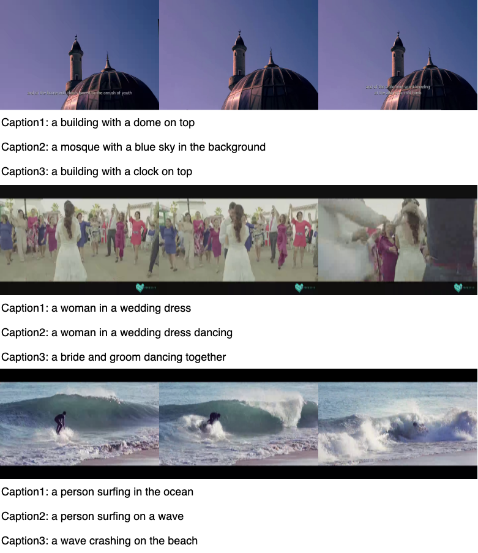

# V3C1-PC

V3C1-Pseudo-Caption (V3C1-PC) is an auto-generated video description dataset for (pre-)training video-text matching models. Building captions based on [BLIP](https://github.com/salesforce/BLIP). Specifically, for each video in V3C1, we use BLIP to generate a caption for each sampled frame.  A $n$-frame video will have $n$ captions. We remove duplicate caption and then use [CLIP](https://github.com/openai/CLIP) to rank the remaining captions in terms of their cross-modality similarity to the video. The top-3 ranked captions are preserved as the video’s pseudo captions.

## Download

[Google Drive Link](https://drive.google.com/file/d/1X8x4Fkd7v_9cKIzA4x9Qr_Sh8UtaF2sa/view?usp=sharing)

## Example



## V3C1-PC Citation

```
@inproceedings{tv22-rucmm,
title = {Renmin University of China at TRECVID 2022: Improving Video Search by Feature Fusion and Negation Understanding},
author = {Xirong Li and Aozhu Chen and Ziyue Wang and Fan Hu and Kaibin Tian and Xinru Chen and Chengbo Dong},
booktitle = {TRECVID 2022 Workshop},
year = {2022},
}
```
