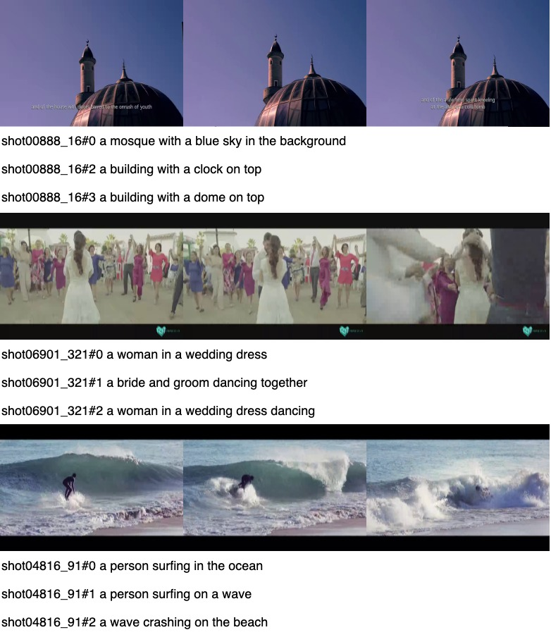

# V3C1-PC

V3C1-Pseudo-Caption (V3C1-PC) is an auto-generated video description dataset for (pre-)training video-text matching models. Pseudo captions for a given video in the [V3C1](https://www-nlpir.nist.gov/projects/tv2022/data.html) collection were generated as follows. We used [BLIP](https://github.com/salesforce/BLIP) to generate a caption for each sampled frame.  An *n*-frame video will have *n* captions. We removed duplicate caption and then used [CLIP](https://github.com/openai/CLIP) to rank the remaining captions in terms of their cross-modality similarity to the video. The top-3 ranked captions were preserved as the video’s pseudo captions. V3C1-PC consists of 436,204 captions for 219,531 video shots.



## Download

+ Caption data (20MB): [Google Drive Link](https://drive.google.com/file/d/1X8x4Fkd7v_9cKIzA4x9Qr_Sh8UtaF2sa/view?usp=sharing)


## V3C1-PC Citation

The dataset was developed during [our participation](https://www-nlpir.nist.gov/projects/tvpubs/tv22.papers/rucmm.pdf) in the TRECVID 2022 [Ad-hoc Video Search (AVS)](https://www-nlpir.nist.gov/projects/tv2022/avs.html) task.

```
@inproceedings{tv22-rucmm,
title = {Renmin {U}niversity of {C}hina at {TRECVID} 2022: Improving Video Search by Feature Fusion and Negation Understanding},
author = {Xirong Li and Aozhu Chen and Ziyue Wang and Fan Hu and Kaibin Tian and Xinru Chen and Chengbo Dong},
booktitle = {TRECVID 2022 Workshop},
year = {2022},
}
```
